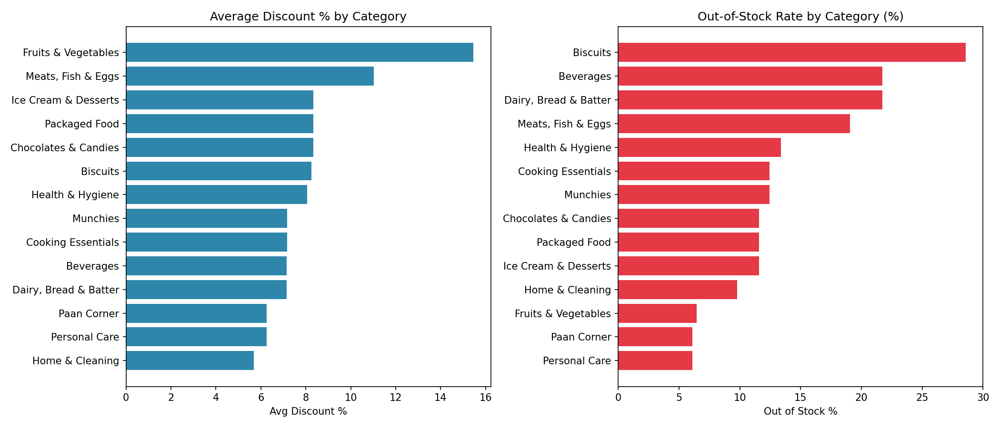

# Zepto Inventory Analysis

## Overview
Exploratory analysis of Zepto's product inventory data — examining pricing,
discounting, stock availability, and category-level patterns across a
quick-commerce grocery catalog of 3,732 SKUs spanning 14 categories.

## Dataset
[Zepto Inventory Dataset](https://www.kaggle.com/datasets/palvinder2006/zepto-inventory-dataset) (Kaggle)

**Columns:** `Category`, `name`, `mrp`, `discountPercent`, `availableQuantity`,
`discountedSellingPrice`, `weightInGms`, `outOfStock`, `quantity`

**Size:** 3,732 rows, 14 product categories, no missing values.

*Note: `mrp` and `discountedSellingPrice` are stored in paise in the raw file
(divide by 100 for INR).*

## Tools Used
Python, Pandas, Matplotlib

## Key Findings

**1. Fruits & Vegetables carries by far the deepest average discount (15.5%)**
— more than double the next closest category (Meats, Fish & Eggs at 11.0%).
Most other categories cluster between 6-8% average discount. This tracks with
perishables needing faster turnover.

**2. Overall out-of-stock rate is 12.1%** (453 of 3,732 SKUs), but this varies
sharply by category:
- **Biscuits has the worst availability** — 28.6% out of stock
- **Beverages** and **Dairy, Bread & Batter** also underperform, both at 21.7%
- **Personal Care** and **Paan Corner** are the most reliably stocked, both
  around 6%

**3. Deeper discounts do not strongly predict stock-outs** — the correlation
between `discountPercent` and `outOfStock` is weak (-0.08), meaning heavily
discounted items aren't meaningfully more likely to run out. Stock-out issues
appear more category-specific (e.g. supply chain for Biscuits/Beverages)
than discount-driven.

**4. Cooking Essentials and Munchies are the largest categories** by SKU count
(514 products each), while Meats, Fish & Eggs is the smallest (63 products).

**5. Paan Corner and Personal Care carry the highest average MRP** (~₹207),
while Fruits & Vegetables and Biscuits are the cheapest categories on average
(~₹47 and ~₹60 respectively).

## Visualization


Left: average discount % by category. Right: out-of-stock rate % by category.
Notice Fruits & Vegetables leads on discounting but has one of the lowest
stock-out rates — while Biscuits and Beverages combine modest discounts with
the weakest availability.

## Recommendations
1. **Investigate Biscuits and Beverages supply chains** — their out-of-stock
   rates (28.6% and 21.7%) are well above the dataset average and don't
   correlate with aggressive discounting, suggesting a restocking/inventory
   issue rather than demand-driven depletion.
2. **Fruits & Vegetables' high discount + low stock-out combination** is worth
   studying as a model — high turnover perishables are being priced
   aggressively without availability suffering.
3. **Review discount strategy consistency** — most non-perishable categories
   sit in a narrow 6-8% discount band; consider whether higher-margin
   categories (Paan Corner, Personal Care) could sustain deeper promotions
   without hurting margins.

## Project Structure
```
zepto-inventory-analysis/
│
├── data/
│   └── zepto_v2.csv
├── notebooks/
│   └── eda.ipynb
├── category_analysis.png
├── README.md
```
